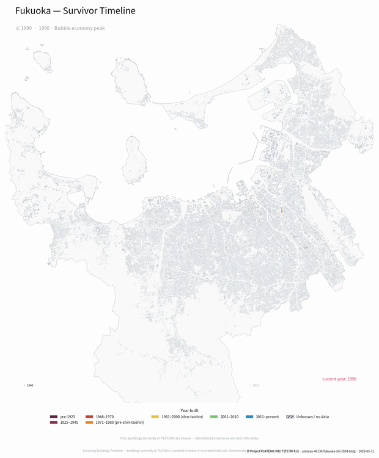

<p align="center">
  <a href="https://yodolabs.jp">
    
  </a>
</p>

<h1 align="center">prettyplateau-web</h1>

<p align="center">
  <strong>Render print-quality <a href="https://www.mlit.go.jp/plateau/">Project PLATEAU</a> city maps in your browser.</strong><br/>
  The hosted live demo for the <a href="https://github.com/pixelx-jp/prettyplateau"><code>prettyplateau</code></a> library.
</p>

<p align="center">
  <a href="https://github.com/pixelx-jp/prettyplateau-web/actions/workflows/deploy.yml"></a>
  <a href="./LICENSE"></a>
  <a href="https://www.mlit.go.jp/plateau/"></a>
</p>

<p align="center">
  <a href="https://prettyplateau.plateau.yodolabs.jp"><strong>🌐 Live demo →</strong></a>
  &nbsp;·&nbsp;
  <a href="./README.ja.md">日本語版 README →</a>
</p>

<p align="center">
  <a href="https://prettyplateau.plateau.yodolabs.jp">
    
  </a>
</p>

---

Pick a city, preset, theme, and format, and render a print-quality city map
(PNG / SVG / PDF / mp4) in the browser. This is the in-browser live demo for the
[`prettyplateau`](https://github.com/pixelx-jp/prettyplateau) rendering library.

Part of Yodo Labs' open-source PLATEAU toolkit:
[`prettyplateau`](https://github.com/pixelx-jp/prettyplateau) (rendering, what
this demo runs) · [`plateau-bridge`](https://github.com/pixelx-jp/plateau-bridge)
(the building-data pipeline it reads) ·
[`plateau-risk-lens`](https://github.com/pixelx-jp/plateau-risk-lens) (a separate
sibling — a 2D disaster-risk map explainer).

## Gallery

|  |  |
|---|---|
|  |  |
| **Height Topo** — Minato's skyline binned by building height. | **Flood Depth** — Kōtō's river-flood exposure; grey hatch = no survey data. |
|  |  |
| **Age Rainbow** — Fukuoka coloured by year built. | **Zoning Mosaic** — Shibuya's 用途地域 zoning categories. |

Nine static presets (usage, height, flood depth, risk, building age, zoning,
density…) × six themes × PNG / SVG / PDF, plus an `mp4` survivor-timeline
animation — all driven live by [`prettyplateau`](https://github.com/pixelx-jp/prettyplateau).

<p align="center">
  <br/>
  <sub><strong>Survivor Timeline</strong> — Fukuoka's buildings revealed in order of year built (prerendered mp4).</sub>
</p>

## Architecture

```
web (static, Vite+React)  ──POST /api/render──►  render-service (FastAPI, Python)
  Cloud Run nginx                                  Cloud Run, min-instances=0
                                                   prettyplateau[animation]
                                                          │
                                            data: public plateau-bridge (29 cities)
                                            cache: GCS (optional) / local dir
```

- **render-service** is a thin wrapper around `prettyplateau.render`. All input
  is white-listed (`allowlist.py`); a cache-first path means repeat
  combinations cost zero compute.
- **Live vs prerendered**: cities under ~150k buildings render on demand; larger
  cities and all mp4 animations are shown as examples in the gallery (server-side
  matplotlib is memory- and CPU-bound, so big cities would take minutes).

## Local development

Requires the sibling `../plateau-core` checkout (the plateau-bridge data) — or
the service will fetch cities from the public index on first use.

```bash
# 1. render-service
python3 -m venv .venv
.venv/bin/pip install -e "../prettyplateau[animation]" fastapi "uvicorn[standard]"
cd render-service
DATA_ROOT=../../plateau-core ../.venv/bin/python -m uvicorn app:app --port 8100

# 2. frontend (separate shell)
cd web
npm install
npm run dev          # http://localhost:5174 — proxies /api to :8100
```

End-to-end smoke test (boots the service, exercises every endpoint + guardrail):

```bash
bash scripts/smoke.sh
```

## Endpoints

| Method | Path | Purpose |
|---|---|---|
| GET | `/api/healthz` | liveness (under `/api` — Cloud Run's GFE intercepts bare `/healthz`) |
| GET | `/api/options` | white-listed cities / presets / themes / formats |
| POST | `/api/render` | render one artifact (cache-first), returns the bytes |

`POST /api/render` body: `{ "city", "preset", "theme", "format", "width" }`.

## Deployment (Cloud Run)

Two services in your GCP project (configured via repo variables/secrets — no
project identifiers are committed):

- `render-service` — 8 GiB / 2–4 vCPU, `--concurrency=1`, `--min-instances=0`,
  `--max-instances=3`, `--timeout=900`. Set `CORS_ORIGINS` to the web origin and
  (optionally) `GCS_CACHE_BUCKET` for a persistent render cache.
- `web` — static build behind nginx; `VITE_API_BASE` points at the
  render-service origin.

CI auth uses Workload Identity Federation (secrets `WIF_PROVIDER`, `DEPLOY_SA`);
config lives in repo variables (`GCP_PROJECT`, `GCP_PROJECT_NUMBER`,
`GCP_REGION`, `GCS_CACHE_BUCKET`). Deploy is gated by the
`CLOUDRUN_DEPLOY_ENABLED` repo variable so forks and fresh checkouts never
auto-deploy. See [`.github/workflows/deploy.yml`](./.github/workflows/deploy.yml).

Optional: `scripts/bake-data.sh` bakes curated cities' parquet into the image
for instant first render.

## Contributing

See [`CONTRIBUTING.md`](./CONTRIBUTING.md) for local setup and the invariants
PRs must respect (chief among them: attribution can't be disabled).

## Licence

- Code: MIT (see [`LICENSE`](./LICENSE))
- Generated outputs carry © Project PLATEAU / MLIT (CC BY 4.0), embedded in the
  artifact and its metadata — it cannot be disabled.
- Third-party notices: [`NOTICE.md`](./NOTICE.md)

---

<div align="center">
Built by <a href="https://yodolabs.jp"><strong>Yodo Labs</strong></a> · PixelX Inc. (ピクセルエックス株式会社) · 東京
<br/>
Questions / partnerships: <a href="mailto:pan@yodolabs.jp">pan@yodolabs.jp</a>
</div>
